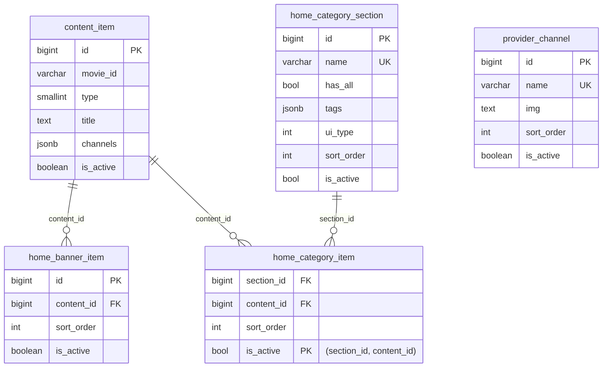

# 数据库表结构说明（Home 重点）

本文档基于当前代码：
- `/Users/xiaohai/Desktop/Developer/android_video/backend/sql/schema.sql`
- `/Users/xiaohai/Desktop/Developer/android_video/backend/src/services/importService.js`
- `/Users/xiaohai/Desktop/Developer/android_video/backend/src/routes/home.js`

## 1. 总览

当前核心表分为三层：

1. 内容主数据：`content_item`
2. TV 剧集数据：`tv_episode_item`
3. 首页编排数据（Home）：
   - `home_banner_item`
   - `provider_channel`
   - `home_category_section`
   - `home_category_item`

另外有一个播放解析缓存表：`play_resolve_cache`。

## 2. Home 模块先看懂这 4 张表

### 2.1 `home_banner_item`（首页 Banner）

用途：定义首页顶部 Banner 的顺序和关联内容。

关键字段：
- `id` `BIGSERIAL` 主键
- `content_id` `BIGINT` -> 关联 `content_item.id`（`ON DELETE SET NULL`）
- `sort_order` `INT` 排序（数字越小越靠前）
- `is_active` `BOOLEAN` 是否生效
- `raw` `JSONB` 原始导入数据快照
- `created_at` / `updated_at`

索引：
- `idx_home_banner_item_sort(sort_order)`

### 2.2 `provider_channel`（首页频道行）

用途：首页频道图标/入口列表（不是播放线路 channels）。

关键字段：
- `id` `BIGSERIAL` 主键
- `name` `VARCHAR(64)` 频道名（唯一）
- `img` `TEXT` 频道图标 URL
- `sort_order` `INT`
- `is_active` `BOOLEAN`
- `raw` `JSONB`
- `created_at` / `updated_at`

约束与索引：
- 唯一：`uq_provider_channel_name(name)`

### 2.3 `home_category_section`（首页分区）

用途：定义首页每个区块（例如 Trending、Popular）。

关键字段：
- `id` `BIGSERIAL` 主键
- `name` `VARCHAR(128)` 分区名（唯一）
- `has_all` `BOOLEAN` 前端是否展示“查看全部”
- `tags` `JSONB` 分区标签数组
- `ui_type` `INT` 前端 UI 类型
- `sort_order` `INT`
- `is_active` `BOOLEAN`
- `raw` `JSONB`
- `created_at` / `updated_at`

约束与索引：
- 唯一：`uq_home_category_section_name(name)`
- 索引：`idx_home_category_section_sort(sort_order)`

### 2.4 `home_category_item`（分区下挂内容）

用途：把内容项挂到某个分区里，形成“分区-内容”多对多关系。

关键字段：
- `section_id` `BIGINT` -> `home_category_section.id`（`ON DELETE CASCADE`）
- `content_id` `BIGINT` -> `content_item.id`（`ON DELETE CASCADE`）
- `sort_order` `INT` 区内排序
- `is_active` `BOOLEAN`
- `created_at` / `updated_at`

约束与索引：
- 复合主键：`(section_id, content_id)`
- 索引：`idx_home_category_item_section_sort(section_id, sort_order)`

## 3. Home 的读写流程（最关键）

### 3.1 写入：`POST /api/import/home`

入口：`/api/import/home`

写入逻辑在 `importHomeData()`：

1. `mode=replace` 时先清空 4 张 Home 表：
   - `home_category_item`
   - `home_category_section`
   - `home_banner_item`
   - `provider_channel`
2. Banner：
   - 先 `upsertContent(content_item)`
   - 再写 `home_banner_item(content_id, sort_order)`
3. Channel：
   - 按 `name` upsert 到 `provider_channel`
4. Section + Items：
   - 先 upsert `home_category_section`
   - 再把 section 的每个 item upsert 到 `content_item`
   - 再写 `home_category_item(section_id, content_id, sort_order)`

说明：Home 表主要保存“编排关系”，内容详情都在 `content_item`。

### 3.2 读取：`GET /api/home`

读取逻辑：

1. Banner：`home_banner_item` LEFT JOIN `content_item`
2. Channels：直接查 `provider_channel`
3. Sections：先查 `home_category_section`
4. 每个 section 再查 `home_category_item` JOIN `content_item`

最终返回结构：
- `banner: ContentItem[]`
- `channels: [{name,img}]`
- `sections: [{name,has_all,tags,ui_type,items: ContentItem[]}]`

## 4. 关系图（简化）



## 5. 其它核心表（快速版）

### 5.1 `content_item`（内容主表）

用途：电影/剧集主数据，首页和搜索都依赖它。

关键点：
- 主键：`id`
- 业务唯一键：`(movie_id, type)`
- `type`: `1=movie`, `2=tv`
- `channels`: 播放线路 JSON（如 UpCloud/Vidcloud）
- `tag`: 平台或标签（如 Netflix/HBO）
- `raw`: 上游原始数据
- 常用索引：`tmdb_id`、`release_year`、`tag`、`channels GIN`、`raw GIN`

### 5.2 `tv_episode_item`（TV 剧集表）

用途：存每一集数据，按 `movie_id` 关联到 `content_item`。

关键点：
- 主键：`id`
- 关键唯一：`(movie_id, season_num, episode_num)`
- `channels`: 每集播放线路
- `season/episode` 显示名 + `season_num/episode_num` 排序编号

### 5.3 `play_resolve_cache`（解析缓存）

用途：缓存线路解析结果。

关键字段：
- `line_url`
- `response_data` JSON
- `expire_at`
- `last_status` / `error_msg`

## 6. 统一机制：`updated_at` 自动维护

所有主要表都挂了 trigger：
- `BEFORE UPDATE` 时执行 `set_updated_at()`
- 自动把 `updated_at` 改为 `now()`

你不需要在业务 SQL 手动维护该字段（除个别明确手写更新语句场景）。

## 7. 你最常会用到的查询示例

### 7.1 看首页某个分区下内容

```sql
SELECT s.name AS section_name, i.sort_order, c.id, c.movie_id, c.title
FROM home_category_section s
JOIN home_category_item i ON i.section_id = s.id
JOIN content_item c ON c.id = i.content_id
WHERE s.is_active = true AND i.is_active = true AND c.is_active = true
ORDER BY s.sort_order, i.sort_order;
```

### 7.2 看某个 TV 的剧集数量

```sql
SELECT movie_id, count(*) AS episodes
FROM tv_episode_item
WHERE movie_id = '1399' AND is_active = true
GROUP BY movie_id;
```

### 7.3 看平台标签分布（tag）

```sql
SELECT COALESCE(tag, '__NULL__') AS tag, COUNT(*)
FROM content_item
GROUP BY 1
ORDER BY 2 DESC;
```

## 8. 常见误区

1. `provider_channel` 不是 `content_item.channels`。
: 前者是首页频道入口，后者是具体片源线路。

2. `movie_id` 不是永远等于 `tmdb_id`。
: 你的数据里两者可能不一致，做剧集关联要看 `tv_episode_item.movie_id` 是否匹配。

3. Home 是“编排层”，不是“主数据层”。
: Home 只决定怎么展示，内容详情都在 `content_item`。
