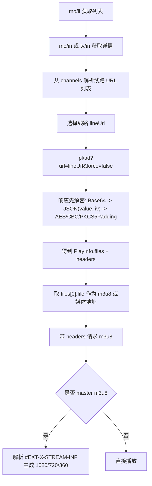

# APK 播放链路文档（如何拿到 m3u8）

## 1. 总览
该 APK 不是靠 WebView 嗅探拿源，而是：

1. 请求业务接口拿影片详情（含线路 `channels`）。
2. 选中一条线路 URL。
3. 调 `pl/ad` 接口做播放解析，返回 `files`（含 `type=file`/`hls` + `headers`）。
4. 取 `files[0].file`，通常是 m3u8 地址。
5. 用返回的 `headers`（如 `Referer`/`Origin`）请求 m3u8。
6. 若是主播放列表（master m3u8），继续解析多清晰度子流。

## 2. 流程图


## 3. 关键接口
Base URL:
- `https://cineframeplayer.com/module-movie/`

主要接口:
- 列表: `GET mo/li`
- 详情: `GET mo/in?id=...` / `GET tv/in?id=...`
- 分集: `GET tv/ep/li?movie_id=...`
- 播放解析: `GET pl/ad?url=...&force=false`
- 字幕: `GET play/caption?url=...`（带 `language`）

请求头:
- `x-requested-with: com.cine.frame.hd.video.player`
- `x-app-version: 1.1.1`
- `language: en`

## 4. 解密机制（重点）
服务端返回加密包，客户端在网络拦截器统一解密。

加密包结构（Base64 解出后）:
- `value`: 密文（Base64）
- `iv`: 向量（字符串）

客户端解密参数:
- AES key: `8fOsTegF23mV43Nr6xiOisP34ZPN41WC`
- 算法: `AES/CBC/PKCS5Padding`

因此 `pl/ad` 的真实 JSON 需要先解密才能拿到 `files`。

## 5. m3u8 获取的最小步骤
1. `mo/in` 取详情。
2. 从详情的 `channels` JSON 中选一条线路 URL。
3. 调 `pl/ad`，解密返回。
4. 解析 `data.files`（JSON 字符串），取第一项:
   - `file`: 播放地址（常见是 m3u8）
   - `headers`: 回源头（必须带上）
5. 请求 `file`，若返回 master m3u8，再解析子清晰度 URL。

## 6. 与 WebView 嗅探方案对比
API 解析链路（本 APK）:
- 优点: 稳定、可控、速度快、易做重试切线。
- 风险: 依赖后端解析服务可用性（`pl/ad`）。

WebView 嗅探链路（你们当前）:
- 优点: 对三方站点兼容广。
- 风险: 规则维护成本高，站点变动易失效，首播耗时高。

建议混合策略:
1. 优先走 API 解析（若你们有自建解析服务）。
2. API 失败时再 fallback 到 WebView 嗅探。
3. 统一产出 `PlayableSource{url, headers, quality}` 给播放器层。

## 7. 代码证据（反编译定位）
- 接口定义:
  - `/tmp/cine_single/sources/com/cine/frame/hd/video/player/mm/data/api/ApiService.java`
- Base URL / 拦截器挂载:
  - `/tmp/cine_single/sources/com/cine/frame/hd/video/player/mm/data/api/NetUtils.java`
- 请求头注入:
  - `/tmp/cine_single/sources/com/cine/frame/hd/video/player/mm/data/interceptor/RequestInterceptor.java`
- 响应解密:
  - `/tmp/cine_single/sources/com/cine/frame/hd/video/player/mm/data/interceptor/ResponseInterceptor.java`
- 详情线路解析（movie channels）:
  - `/tmp/cine_jadx/sources/com/cine/frame/hd/video/player/mm/model/MovieEntity.java`
- 播放重试/切线 + m3u8 质量解析:
  - `/tmp/cine_single/sources/com/cine/frame/hd/video/player/mm/ui/detail/D67c.java`
- 页面触发播放请求:
  - `/tmp/cine_single/sources/com/cine/frame/hd/video/player/mm/ui/detail/MovPlyDe.java`

## 8. 你们项目可直接复用的数据结构
```text
PlayableSource {
  lineName: String
  lineUrl: String
  mediaUrl: String
  headers: Map<String, String>
  type: hls|mp4|...
  qualities: List<QualityItem>
}
```

